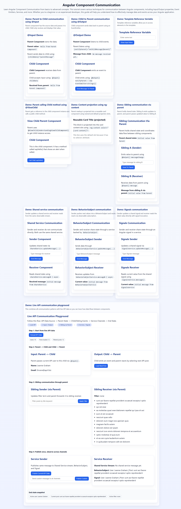

# Angular Component Communication

Hands-on Angular 19 demo project to understand component communication patterns with clear, visual examples.

## What this project covers

- Parent to Child using `@Input`
- Child to Parent using `@Output` + `EventEmitter`
- Template Reference Variable
- `@ViewChild` parent-to-child method access
- Content Projection with `ng-content`
- Sibling Communication via Parent
- Shared Service Communication
- BehaviorSubject-based Communication
- Signals-based Communication
- Live API Communication Playground (all patterns in one flow)

## Tech stack

- Angular `19.2.x`
- Standalone components
- RxJS (`Subject`, `BehaviorSubject`)
- Angular Signals
- Angular `HttpClient`
- JSONPlaceholder API (`https://jsonplaceholder.typicode.com`)

## Run locally

Install dependencies:

```bash
npm install
```

Start app:

```bash
npm start
```

Open:

`http://localhost:4200`

## Build and test

Build:

```bash
npm run build
```

Unit tests:

```bash
npm test
```

## Project structure

Main demo modules live under:

`src/app/components/`

Key feature folders:

- `understanding-input-parent-child`
- `understanding-output-child-parent`
- `understanding-template-reference`
- `understanding-view-child`
- `understanding-content-projection`
- `understanding-sibling-communication`
- `understanding-shared-service-communication`
- `understanding-behaviorsubject-communication`
- `understanding-signals-communication`
- `understanding-live-api-communication`

Shared card UI:

`src/app/shared/card/`

## Live API playground flow

The **Live API Communication Playground** demonstrates full data flow:

1. Load live API users/posts into parent state
2. Pass selected user to child (`@Input`)
3. Emit event from child to parent to rotate posts (`@Output`)
4. Send filter from sibling A to sibling B via parent
5. Publish one message to Shared Service stream, BehaviorSubject, and Signal
6. Observe values in receiver component

## Notes

- `HttpClient` is configured in `src/app/app.config.ts` using `provideHttpClient()`.
- UI and input/button interactions are normalized through shared global styles in `src/styles.scss`.

## Screenshot


