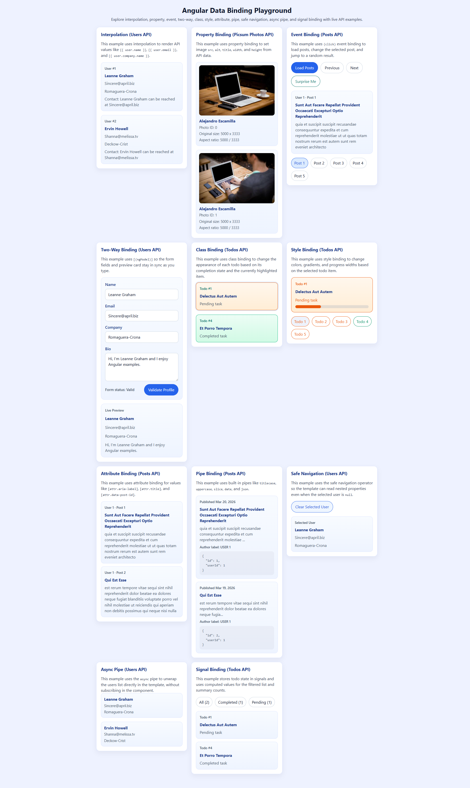

# Angular Data Binding Playground

A learning-focused Angular 19 app that demonstrates core Angular data binding patterns using small standalone demo components, reusable cards, and live API-backed examples for users, posts, todos, and photos.

## Tech Stack

- Angular 19
- TypeScript
- SCSS
- RxJS
- Angular Forms
- Angular Signals
- JSONPlaceholder API
- Picsum Photos API

## Getting Started

### Prerequisites

- Node.js 18+ (latest LTS recommended)
- npm

### Install

```bash
npm install
```

### Run Locally

```bash
npm start
```

The app runs at `http://localhost:4200/`.

## Available Scripts

- `npm start` - start development server
- `npm run build` - create production build
- `npm run watch` - build in watch mode (`development` config)
- `npm test` - run Karma unit tests

## Project Structure

```text
src/
  app/
    components/      # standalone demo components for each binding type
    services/        # API service for users, posts, todos, and photos
    shared/          # reusable UI components (card)
```

## App Composition

- The app is bootstrapped with `bootstrapApplication` in `src/main.ts`.
- Global providers are configured in `src/app/app.config.ts`, including router setup and `provideHttpClient()`.
- `AppComponent` renders the full binding playground and introduces the demos with a page title and subtitle.
- Shared API access is centralized in `src/app/services/api-service.service.ts`.
- The page is split into standalone components for readability:
  - `db-interpolation`
  - `db-property-binding`
  - `db-event-binding`
  - `db-two-way-binding`
  - `db-class-binding`
  - `db-style-binding`
  - `db-attribute-binding`
  - `db-pipe-binding`
  - `db-safe-navigation`
  - `db-async-pipe`
  - `db-signal-binding`

## Demo Coverage

From `src/app/app.component.html`:

- `db-interpolation` - renders user values with `{{ ... }}`
- `db-property-binding` - binds image and element properties from Picsum photo data
- `db-event-binding` - reacts to button clicks and post selection changes
- `db-two-way-binding` - demonstrates `[(ngModel)]` with template-driven validation
- `db-class-binding` - toggles CSS classes using todo completion state
- `db-style-binding` - applies dynamic inline styles using todo data
- `db-attribute-binding` - binds `aria`, `title`, and `data-*` attributes on posts
- `db-pipe-binding` - formats post values with Angular built-in pipes
- `db-safe-navigation` - safely reads nested user data with `?.`
- `db-async-pipe` - unwraps users from an observable in the template
- `db-signal-binding` - manages todo state with Angular signals and computed values

## API Usage

The app uses a small service layer in `src/app/services/api-service.service.ts` to keep the demos simple and consistent.

Current endpoints:

- `getUsers()` - `https://jsonplaceholder.typicode.com/users`
- `getPosts()` - `https://jsonplaceholder.typicode.com/posts`
- `getTodos()` - `https://jsonplaceholder.typicode.com/todos`
- `getPhotos()` - `https://picsum.photos/v2/list`

## Shared Components

Defined in `src/app/shared`:

- `app-card` - reusable projected card layout used across all binding demos

## Notes

- The app mixes observable-based and synchronous state patterns so each binding type can be demonstrated in a focused way.
- Most demos intentionally limit the number of rendered API items to keep the UI small and easy to compare.
- The two-way binding example uses template-driven validation to mirror common reactive-form validation concepts.
- The signal binding example uses Angular signals and computed values instead of RxJS in the component state layer.
- Unit tests use mocked service responses so the demos do not depend on live network access during test runs.

## Screenshot


