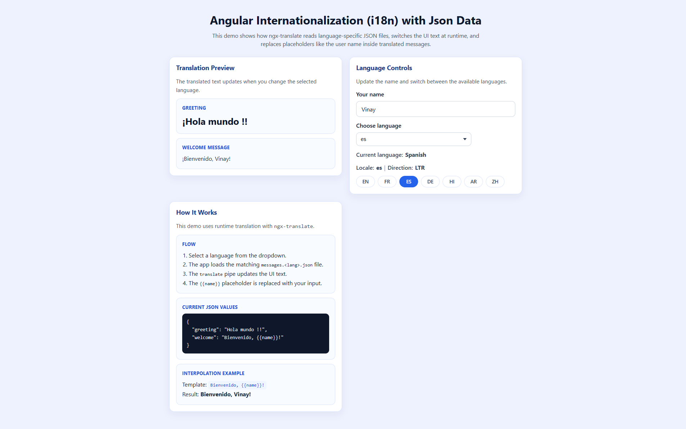

# Angular i18n JSON Demo

A learning-focused Angular 19 app that demonstrates runtime internationalization using `ngx-translate`, language-specific JSON files, placeholder interpolation, and basic RTL/LTR direction handling through small standalone demo components.

## Tech Stack

- Angular 19
- TypeScript
- SCSS
- RxJS
- `@ngx-translate/core`
- `@ngx-translate/http-loader`

## Getting Started

### Prerequisites

- Node.js 18+ (latest LTS recommended)
- npm

### Install

```bash
npm install
```

### Run Locally

```bash
npm start
```

The app runs at `http://localhost:4200/`.

## Available Scripts

- `npm start` - start development server
- `npm run build` - create production build
- `npm run watch` - build in watch mode (`development` config)
- `npm test` - run Karma unit tests

## Project Structure

```text
src/
  app/
    components/      # feature/demo components rendered by AppComponent
    shared/          # reusable UI components (card, dropdown)
  assets/
    i18n/            # translation JSON files for each supported language
```

## App Composition

- The app is bootstrapped with `bootstrapApplication` in `src/main.ts`.
- `AppComponent` manages the selected language, current user name, derived display data, and document text direction.
- Runtime translation is configured in `src/app/app.config.ts` using `provideTranslateService` and `provideTranslateHttpLoader`.
- Router is configured, but `src/app/app.routes.ts` currently exports an empty route array.
- The page is split into standalone components for readability:
  - `translation-preview`
  - `language-controls`
  - `how-it-works`

## Translation Setup

Translation files live in `src/assets/i18n`:

- `messages.en.json`
- `messages.fr.json`
- `messages.es.json`
- `messages.de.json`
- `messages.hi.json`
- `messages.ar.json`
- `messages.zh.json`

The app loads files using this pattern:

- `messages.<lang>.json`

Current demo keys:

- `greeting`
- `welcome`

## Demo Features

From `src/app/app.component.html`:

- `translation-preview` - shows translated greeting and personalized welcome output
- `language-controls` - updates the user name, switches the active language, and displays locale plus text direction
- `how-it-works` - explains runtime translation flow, shows current JSON values, and demonstrates interpolation

## Shared Components

Defined in `src/app/shared`:

- `app-card` - reusable projected card layout for each demo section
- `app-dropdown` - custom language selector used by the controls card

## Notes

- The app uses runtime translation with `ngx-translate`, not Angular build-time `@angular/localize`.
- The selected language is initialized from the browser locale when supported, otherwise it falls back to English.
- The entered user name is stored in `localStorage` and restored on reload.
- Arabic switches the document direction to RTL; other languages use LTR.
- The explanatory JSON snippet in the UI is derived from component state so the demo remains easy to follow.

## Screenshot


