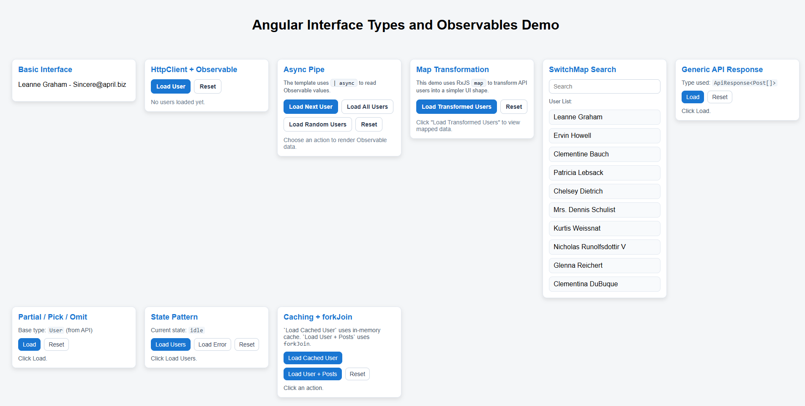

# Angular Interfaces, Types, and Observables Playground

A learning-focused Angular 19 app that demonstrates TypeScript interfaces, types, Observable patterns, async operations, and state management using small standalone demo components.

## Tech Stack

- Angular 19 (standalone components)
- TypeScript 5
- RxJS 7
- SCSS
- Karma + Jasmine for unit tests

## Getting Started

### Prerequisites

- Node.js 18+ (latest LTS recommended)
- npm

### Install

```bash
npm install
```

### Run Locally

```bash
npm start
```

The app runs at `http://localhost:4200/`.

## Available Scripts

- `npm start` - Run dev server (`ng serve`)
- `npm run build` - Production build
- `npm run watch` - Development build in watch mode
- `npm test` - Run unit tests

## Project Structure

```text
src/
  app/
    components/           # demo feature components
    shared/               # reusable UI components (card)
    models/               # shared interfaces and types
    app.component.ts      # main app component
    app.config.ts         # application configuration
    app.routes.ts         # route configuration
```

## App Composition

- The app is bootstrapped with `bootstrapApplication` in `src/main.ts`.
- `AppComponent` renders demo components directly in `src/app/app.component.html`.
- `ComponentsModule` aggregates and exports all standalone demo components.
- HTTP client is configured via `provideHttpClient()` in `app.config.ts`.

## Demo Components

From `src/app/app.component.html`:

- `basic-interfaces` - Demonstrates TypeScript interface definitions and usage patterns
- `http-observable` - Shows HTTP calls using `HttpClient` returning observables
- `async-pipe` - Demonstrates the `async` pipe for subscribing to observables in templates
- `map-transformation` - RxJS `map` operator for transforming observable data
- `switch-map` - RxJS `switchMap` operator for switching between observables
- `generic-api-response` - Generic types/interfaces for type-safe API responses
- `partial-pick-omit` - TypeScript utility types (`Partial`, `Pick`, `Omit`) usage
- `state-pattern` - State management pattern using observables and subjects
- `caching-forkjoin` - Combines observables with caching using `forkJoin` operator

## Key Concepts Covered

### TypeScript Interfaces & Types

- Basic interface definitions
- Generic interfaces for API responses
- Utility types (`Partial`, `Pick`, `Omit`, `Readonly`, etc.)
- Type-safe data modeling

### Observables & RxJS

- Creating observables from HTTP calls
- Observable operators: `map`, `switchMap`, `forkJoin`, `tap`
- Subscribe and unsubscribe patterns
- Observable composition and chaining

### Angular Templates

- `async` pipe for automatic subscription handling
- OnPush change detection strategies
- Standalone components
- Template syntax for observable data

### State Management

- Simple state patterns with subjects
- Observable-based state sharing
- Caching strategies
- Data fetching patterns

## Notes

- Most demo components are standalone and imported through `ComponentsModule` for easy reuse.
- Components demonstrate practical, real-world patterns used in Angular applications.
- The app is built for learning and experimentation with interfaces, types, and reactive patterns.

## Screenshot


