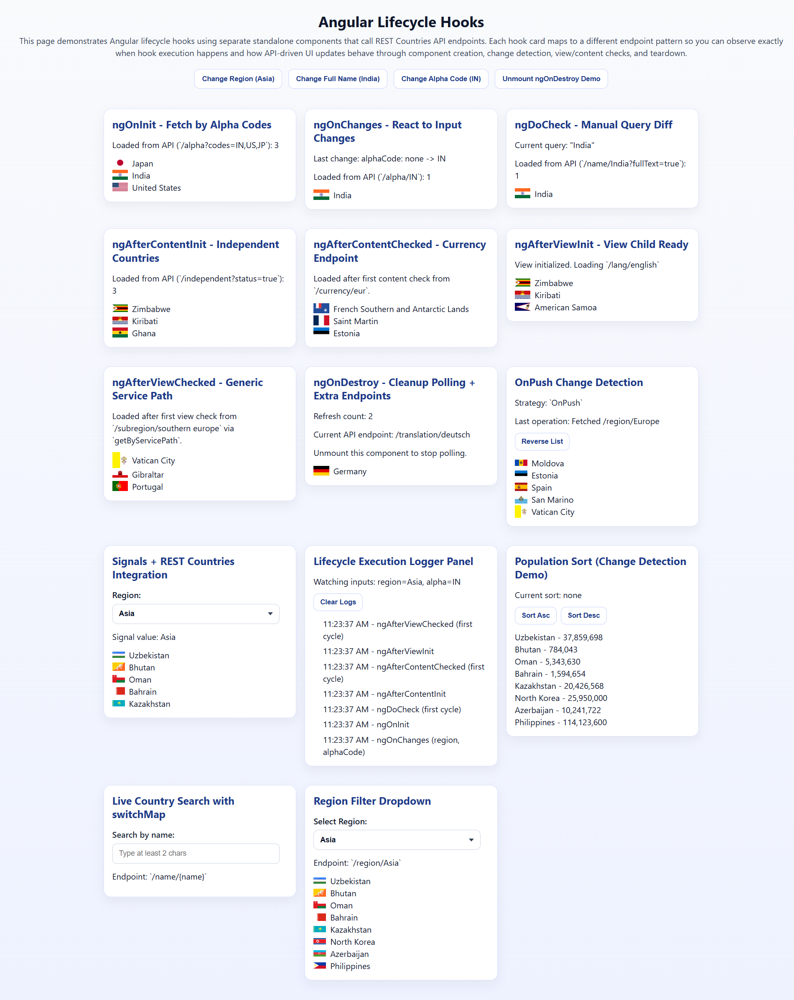

# Angular Lifecycle Hooks Playground

A learning-focused Angular 19 app that demonstrates Angular lifecycle hooks, change detection patterns, signals, and RxJS-driven API flows using small standalone demo components backed by the REST Countries API.

## Tech Stack

- Angular 19
- TypeScript
- SCSS
- RxJS

## Getting Started

### Prerequisites

- Node.js 18+ (latest LTS recommended)
- npm

### Install

```bash
npm install
```

### Run Locally

```bash
npm start
```

The app runs at `http://localhost:4200/`.

## Available Scripts

- `npm start` - start development server
- `npm run build` - create production build
- `npm run watch` - build in watch mode (`development` config)
- `npm test` - run Karma unit tests

## Project Structure

```text
src/
  app/
    components/      # lifecycle hook and change detection demos
    services/        # REST Countries API service
    shared/          # reusable UI pieces (card/custom dropdown)
    interfaces/      # shared app interfaces
```

## App Composition

- The app is bootstrapped with `bootstrapApplication` in `src/main.ts`.
- `AppComponent` renders all demo components directly in `src/app/app.component.html`.
- Router is configured, but `src/app/app.routes.ts` currently exports an empty route array.
- `ComponentsModule` aggregates and exports the standalone demo components used by the root component.
- Top-level controls let you cycle `region`, `full name`, and `alpha code` inputs and toggle the `ngOnDestroy` demo on and off.

## Data Source

`CountryService` uses the REST Countries API (`https://restcountries.com/v3.1`) and wraps several endpoint patterns, including:

- `/all`
- `/name/{name}`
- `/name/{name}?fullText=true`
- `/alpha/{code}`
- `/alpha?codes={codes}`
- `/region/{region}`
- `/subregion/{subregion}`
- `/currency/{currency}`
- `/lang/{language}`
- `/capital/{capital}`
- `/demonym/{demonym}`
- `/translation/{translation}`
- `/independent?status=true`

Service methods normalize single-object and array responses into `Country[]` and return fallback empty arrays on HTTP errors.

## Demo Components (Currently Rendered)

From `src/app/app.component.html`:

- `understanding-ng-on-init` - fetches countries by alpha codes during `ngOnInit`
- `understanding-ng-on-changes` - reacts to changing `region` and `alphaCode` inputs inside `ngOnChanges`
- `understanding-ng-do-check` - manually diffs a search query in `ngDoCheck` and runs full-text name lookups
- `understanding-ng-after-content-init` - loads independent countries in `ngAfterContentInit`
- `understanding-ng-after-content-checked` - triggers a one-time currency lookup in `ngAfterContentChecked`
- `understanding-ng-after-view-init` - uses `ViewChild` readiness in `ngAfterViewInit` before loading language data
- `understanding-ng-after-view-checked` - schedules a one-time subregion request from `ngAfterViewChecked`
- `understanding-ng-on-destroy` - starts polling alternating endpoints and cleans up the subscription in `ngOnDestroy`
- `understanding-on-push-change-detection` - demonstrates `ChangeDetectionStrategy.OnPush` with immutable updates and `markForCheck`
- `understanding-signals-rest-integration` - connects an Angular signal-driven region selector to REST data
- `understanding-lifecycle-logger-panel` - logs hook execution order across the main lifecycle sequence
- `understanding-population-sort-demo` - fetches a country list and reorders it by population
- `understanding-live-country-search-switchmap` - debounced live search using RxJS `switchMap`
- `understanding-region-filter-dropdown` - filters countries by region using a reusable dropdown

## Shared UI

- `card` - consistent visual wrapper used by the demos
- `custom-dropdown` - reusable region selector used by the signals and filter demos

## Notes

- Most demo components are standalone and grouped through `ComponentsModule` for convenience.
- `AppComponent` drives several hook demos by rotating preset values for regions, country names, and alpha codes.
- `UnderstandingLifecycleLoggerPanelComponent` intentionally logs only the first `ngDoCheck`, `ngAfterContentChecked`, and `ngAfterViewChecked` cycles to keep the panel readable.
- `UnderstandingNgOnDestroyComponent` demonstrates cleanup by unsubscribing from a polling stream when the component is removed from the DOM.

## Screenshot


