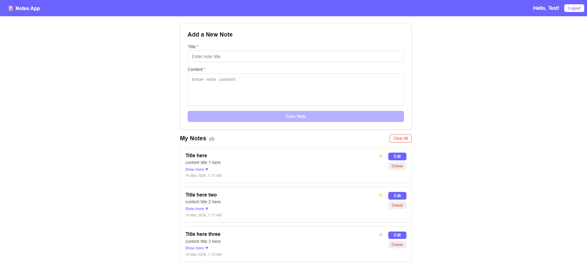

# Angular Notes Application

A comprehensive notes management application built with Angular 19.2.19. This project demonstrates Angular fundamentals including standalone components, routing with guards, services, form validation, and TypeScript interfaces.

## What is covered

- Standalone components architecture
- Angular Router with route guards (`AuthGuard`)
- Service-based state management (authentication, notes, toast notifications)
- Template-driven and reactive form patterns
- Custom form validators
- TypeScript interfaces and type safety
- Component communication via services
- CRUD operations (Create, Read, Update, Delete)
- Modal confirmation dialogs
- Toast notification system
- SCSS styling with responsive design

## Tech Stack

- **Framework**: Angular 19.2.19 (standalone components)
- **Styling**: SCSS
- **Testing**: Karma & Jasmine
- **Build Tool**: Angular CLI 19.2.19
- **Language**: TypeScript 5.7.2

## Project structure

- `src/app/app.component.ts`: root component with router outlet
- `src/app/app.routes.ts`: application routing configuration
- `src/app/components/`: feature components (authentication, notes, modals, toast)
- `src/app/services/`: business logic (authentication, notes, toast management)
- `src/app/guards/`: route protection (`auth.guard.ts`)
- `src/app/validators/`: custom validation rules
- `src/app/interfaces/`: TypeScript contracts (user, note, toast)
- `src/styles.scss`: shared application styles
- `src/main.ts`: application bootstrap

## Components

- `login`: user login with authentication
- `register`: new user registration
- `notes-page`: container component for notes features
- `notes-form`: create/edit note form
- `notes-list`: display all user notes
- `confirmation-modal`: reusable confirmation dialog
- `toast`: notification display component

## Services

- `authentication.service.ts`: login, register, token management
- `note.service.ts`: CRUD operations for notes
- `toast.service.ts`: notification lifecycle management

## Prerequisites

- Node.js 18+
- npm 9+

## Install

```bash
npm install
```

## Run the app

```bash
npm start
```

Open: `http://localhost:4200/`

The application will automatically reload when you modify source files.

## Build

```bash
npm run build
```

Production build artifacts are stored in the `dist/` directory.

## Scripts

- `npm start` - start Angular dev server
- `npm run build` - production build
- `npm run watch` - development build in watch mode
- `npm test` - unit tests with Karma

## Key files

- Root component: [`src/app/app.component.ts`](./src/app/app.component.ts)
- Routing config: [`src/app/app.routes.ts`](./src/app/app.routes.ts)
- Auth guard: [`src/app/guards/auth.guard.ts`](./src/app/guards/auth.guard.ts)
- Authentication service: [`src/app/services/authentication.service.ts`](./src/app/services/authentication.service.ts)
- Notes service: [`src/app/services/note.service.ts`](./src/app/services/note.service.ts)
- Notes page: [`src/app/components/notes-page/notes-page.component.ts`](./src/app/components/notes-page/notes-page.component.ts)
- Note validators: [`src/app/validators/note.validators.ts`](./src/app/validators/note.validators.ts)

## Application routes

- `/login` - User login page
- `/register` - User registration page
- `/notes` - Notes management page (protected by AuthGuard)
- `/` - Redirects to login

## Authentication flow

1. User navigates to `/login` or `/register`
2. Login: credentials validated → token stored → redirect to `/notes`
3. Register: new user created → redirect to `/login`
4. Protected route: `AuthGuard` checks authentication → grant/deny access
5. Token validation: used on subsequent API calls

## Notes CRUD flow

1. **Read**: `notes-page` loads all user notes via `note.service`
2. **Create**: `notes-form` in create mode → POST new note → refresh list
3. **Update**: click Edit → populate form → submit → PUT to update → refresh list
4. **Delete**: click Delete → confirmation modal → DELETE → refresh list
5. **List**: `notes-list` displays all notes with Edit/Delete actions

## Common issues and fixes

- **Cannot login**: Check authentication credentials and service configuration
- **Router shows blank page**: Verify `AuthGuard` implementation and token storage
- **Notes not loading**: Confirm `note.service` is properly injected in `notes-page`
- **Form validation not working**: Check `note.validators.ts` and template binding
- **Dependency issues**: Re-run `npm install`

## Next enhancements (optional)

- Add search and filter functionality to notes list
- Add sorting options (date, title, modified)
- Implement local storage or backend persistence
- Add rich text editor for note content
- Add categories/tags for note organization
- Add note sharing functionality
- Implement optimistic UI updates

## Screenshot



