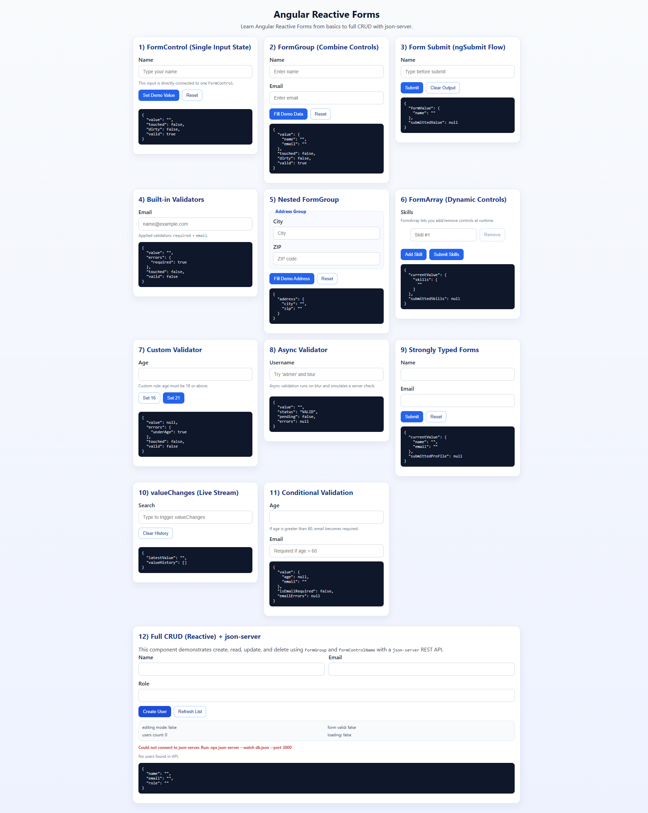

# Understanding Angular Reactive Forms

A hands-on Angular 19 project to learn Reactive Forms from basics to advanced use-cases, plus a full Reactive CRUD example backed by `json-server`.

## What this project covers

This repo is structured as small, focused demo components. Each card in the UI demonstrates one concept:

1. `FormControl` basics
2. `FormGroup` basics
3. Form submit flow (`ngSubmit`)
4. Built-in validators
5. Nested `FormGroup`
6. `FormArray` dynamic controls
7. Custom validator
8. Async validator
9. Strongly typed reactive forms
10. `valueChanges` stream
11. Conditional validation
12. Full Reactive CRUD with API integration

## Tech stack

- Angular `19.2.x`
- Reactive Forms (`@angular/forms`)
- HttpClient (`@angular/common/http`)
- `json-server` for local mock REST API

## Project structure (important files)

- App shell:
  - `src/app/app.component.html`
  - `src/app/app.component.scss`
- Reactive form demos:
  - `src/app/components/*`
- Reactive CRUD demo:
  - `src/app/components/understanding-reactive-crud/`
- Local API seed data:
  - `db.json`

## Prerequisites

- Node.js `18+` (recommended)
- npm

## Install dependencies

```bash
npm install
```

## Run the app

```bash
npm start
```

Open: `http://localhost:4200/`

## Run local API (`json-server`)

```bash
npm run api
```

API base URL:

```text
http://localhost:3000
```

Users endpoint used by CRUD component:

```text
http://localhost:3000/users
```

## Run app + API together (recommended while learning CRUD)

Use two terminals:

Terminal 1:

```bash
npm run api
```

Terminal 2:

```bash
npm start
```

## Available scripts

- `npm start` - Angular dev server
- `npm run build` - Production build
- `npm run watch` - Build in watch mode
- `npm test` - Unit tests
- `npm run api` - Start `json-server` on port `3000`

## Reactive CRUD flow (how it works)

In `understanding-reactive-crud`:

- Form is defined using `FormGroup` and typed `FormControl`s.
- Validation is done with built-in validators (`required`, `email`, `minLength`).
- `createUser` sends `POST /users`.
- `loadUsers` sends `GET /users`.
- `editUser` patches selected row into the form.
- `updateUser` sends `PUT /users/:id`.
- `deleteUser` sends `DELETE /users/:id`.
- UI exposes loading, success, and error states.

## Learning tips

- Start from component 1 and move in order.
- Watch each card's JSON debug block to understand control/form state (`touched`, `dirty`, `valid`, `errors`).
- In conditional and async validation demos, change one input at a time and observe status changes.
- For `FormArray`, add/remove controls and inspect output shape.

## Troubleshooting

- If CRUD shows API connection errors:
  - ensure `npm run api` is running
  - check port `3000` is free
  - confirm `db.json` exists at project root
- If Angular app does not load:
  - run `npm install`
  - run `npm start`

## Build

```bash
npm run build
```

Build output:

```text
dist/repro.understanding.angular.reactive.forms
```

## Screenshot


