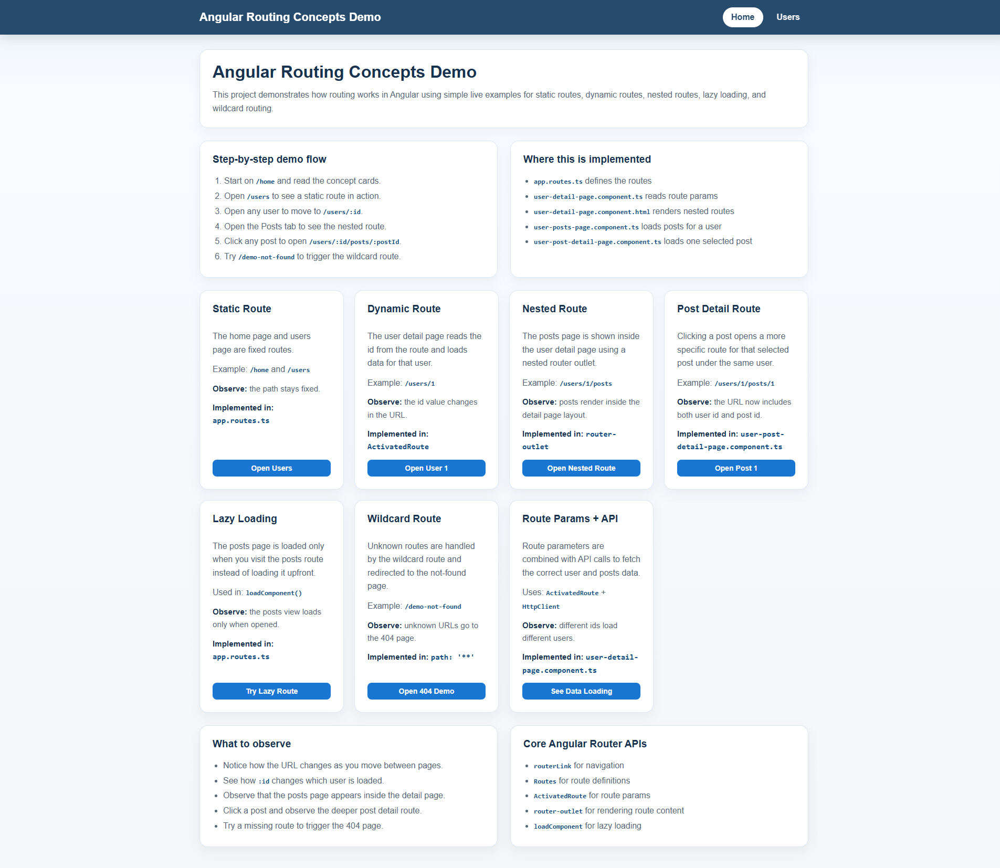
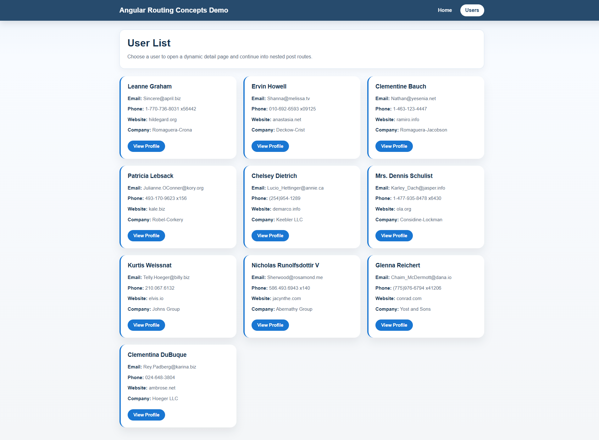
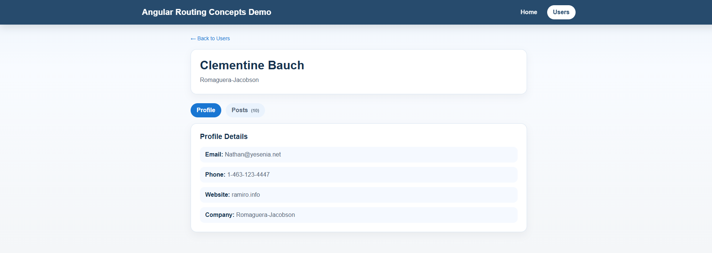
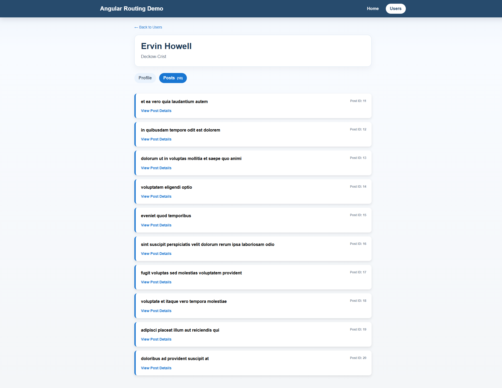
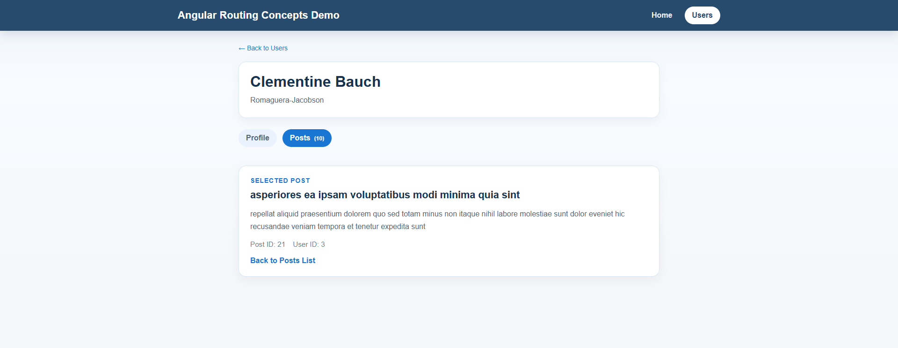

# Angular Routing Demo

Hands-on Angular 19 demo app that explains core Angular Router features with simple live examples powered by JSONPlaceholder data.

## What This Project Demonstrates

The app uses standalone pages and real route navigation to explain common routing patterns:

- `Static Route`: fixed routes like `/home` and `/users`
- `Dynamic Route`: route parameters with `/users/:id`
- `Nested Route`: child route rendering with `/users/:id/posts`
- `Deeper Route`: selected post detail route with `/users/:id/posts/:postId`
- `Lazy Loading`: posts and post-detail pages are loaded with `loadComponent`
- `Wildcard Route`: unknown paths are handled by `**` and routed to the 404 page
- `Route Params + API`: route parameters are used to fetch the correct user and post data

## Demo Flow

You can explore the routing flow in this order:

1. Open `/home`
2. Open `/users`
3. Click a user to navigate to `/users/:id`
4. Open `Posts` to navigate to `/users/:id/posts`
5. Click a post to open `/users/:id/posts/:postId`
6. Try `/demo-not-found` to trigger the wildcard route

## Architecture Notes

- Angular version: `19.2.x`
- Style: standalone components with route-based navigation
- Root shell: navbar + `router-outlet` in `app.component.html`
- Data source: `https://jsonplaceholder.typicode.com`

### Routing

Configured in `app.routes.ts`:

- `/` and `/home` -> homepage for the routing demo
- `/users` -> users list page
- `/users/:id` -> dynamic user detail page
- `/users/:id/posts` -> nested user posts page
- `/users/:id/posts/:postId` -> specific post detail page
- `**` -> not found page

### Services

- `ApiService`: typed wrappers around JSONPlaceholder users/posts endpoints

### Shared UI

- `shared/card`: reusable card shell used across the users/posts views
- `styles.scss`: shared layout, surface card, loader, error, and route-list styling

## Getting Started

### Prerequisites

- Node.js 18+ (or current LTS)
- npm

### Install

```bash
npm install
```

### Run

```bash
npm start
```

Open `http://localhost:4200/`.

## Scripts

- `npm start` - run dev server
- `npm run build` - production build
- `npm run watch` - build in watch mode
- `npm test` - run unit tests (Karma/Jasmine)

## Project Structure

```text
src/app/
  pages/
    home-page/              # routing demo homepage
    users-page/             # users list route
    user-detail-page/       # dynamic user detail route
    user-posts-page/        # nested posts route
    user-post-detail-page/  # specific post detail route
    not-found-page/         # wildcard route page
  services/                 # API service for users/posts
  shared/card/              # reusable card shell
  app.routes.ts             # route definitions
  app.component.*           # app shell and navbar
```

## Notes

- This project is intentionally demo-oriented and uses a public mock API.
- The homepage explains each routing feature and links to a live route example.
- User and post detail pages demonstrate how route params drive API requests.

## Screenshot










