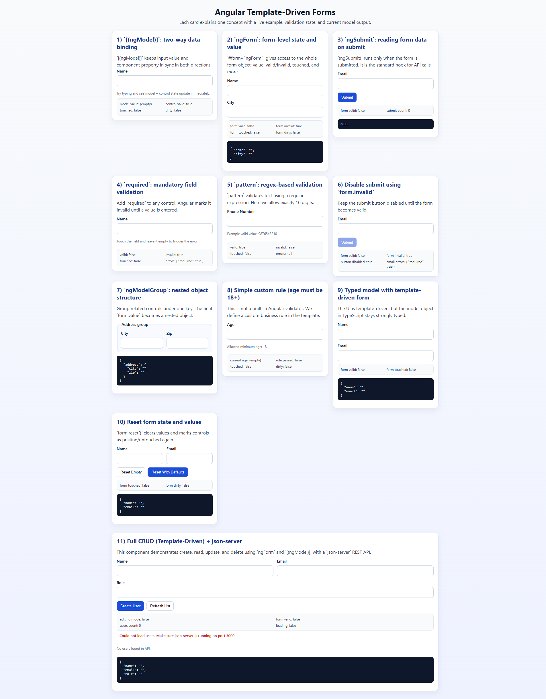

# Understanding Angular Template Driven Forms

This project demonstrates template-driven forms in Angular with focused, standalone examples.

## What is covered

- `[(ngModel)]` two-way binding
- `ngForm` form state and values
- `(ngSubmit)` submit handling
- Required and pattern validations
- Disabling submit on invalid form
- `ngModelGroup` nested form objects
- Simple custom validation rule
- Typed model usage with template-driven forms
- Form reset patterns
- Full CRUD component using template-driven forms + `json-server`

## Project structure

- `src/app/app.component.html`: renders all lesson cards
- `src/app/components/components.module.ts`: central registry of lesson modules
- `src/app/shared/card/*`: reusable card UI used by all lessons
- `src/styles.scss`: shared teaching/demo styles (inputs, states, buttons, layout)

## Lesson components

- `understanding-ng-model`: model and control sync
- `understanding-ng-form`: whole-form state and value
- `understanding-submit`: submit event handling with `NgForm`
- `understanding-required-validations`: `required` validator behavior
- `understanding-pattern-validations`: regex/pattern validation
- `understanding-disabling`: disable submit using `form.invalid`
- `understanding-ng-model-group`: nested form objects with groups
- `understanding-custom-validations`: custom business-rule validation (age)
- `understanding-typed-model`: typed TS model + template-driven inputs
- `understanding-reset`: reset empty and reset with defaults
- `understanding-crud-template-driven`: full create/read/update/delete flow

## Prerequisites

- Node.js 18+
- npm 9+

## Install

```bash
npm install
```

## Run the app

```bash
npm start
```

Open: `http://localhost:4200/`

## Run CRUD backend (`json-server`)

The CRUD lesson uses `http://localhost:3000/users`.

```bash
npm run api
```

This reads from [`db.json`](./db.json).

## CRUD flow (template-driven)

In `understanding-crud-template-driven`:

1. Read: `ngOnInit()` calls `loadUsers()` from service.
2. Create: submit form in create mode (`isEditing = false`) -> `POST /users`.
3. Edit: click `Edit` -> patch form model + `isEditing = true`.
4. Update: submit in edit mode -> `PUT /users/:id`.
5. Delete: click `Delete` -> `DELETE /users/:id`.
6. Refresh: list reloads after every successful write operation.

Service file:

- [`src/app/components/understanding-crud-template-driven/services/crud-template-driven.service.ts`](./src/app/components/understanding-crud-template-driven/services/crud-template-driven.service.ts)

## Run both together

Terminal 1:

```bash
npm run api
```

Terminal 2:

```bash
npm start
```

## Scripts

- `npm start` - start Angular dev server
- `npm run api` - start `json-server` on port `3000`
- `npm run build` - production build
- `npm run watch` - development build in watch mode
- `npm test` - unit tests

## API contract used by CRUD component

Base URL:

- `http://localhost:3000/users`

User shape:

```json
{
  "id": 1,
  "name": "Vinay Ranjan",
  "email": "vinay@example.com",
  "role": "Developer"
}
```

Endpoints:

- `GET /users`
- `POST /users`
- `PUT /users/:id`
- `DELETE /users/:id`

## Key files

- Root lesson page: [`src/app/app.component.html`](./src/app/app.component.html)
- Component registry: [`src/app/components/components.module.ts`](./src/app/components/components.module.ts)
- CRUD component:
  - [`src/app/components/understanding-crud-template-driven/understanding-crud-template-driven.component.ts`](./src/app/components/understanding-crud-template-driven/understanding-crud-template-driven.component.ts)
  - [`src/app/components/understanding-crud-template-driven/understanding-crud-template-driven.component.html`](./src/app/components/understanding-crud-template-driven/understanding-crud-template-driven.component.html)
  - [`src/app/components/understanding-crud-template-driven/services/crud-template-driven.service.ts`](./src/app/components/understanding-crud-template-driven/services/crud-template-driven.service.ts)

## Build

```bash
npm run build
```

## Common issues and fixes

- API errors in CRUD card:
  - Ensure `npm run api` is running on port `3000`.
- CORS/network issues:
  - Confirm app runs on `4200` and API on `3000` (default setup).
- Empty table:
  - Check [`db.json`](./db.json) has a `users` array.
- Dependency/script issues:
  - Re-run `npm install`.

## Next enhancements (optional)

- Add search/filter and client-side pagination to CRUD table.
- Add optimistic UI updates instead of full list reloads.
- Add a dedicated validator directive for reusable custom validations.

## Screenshot


